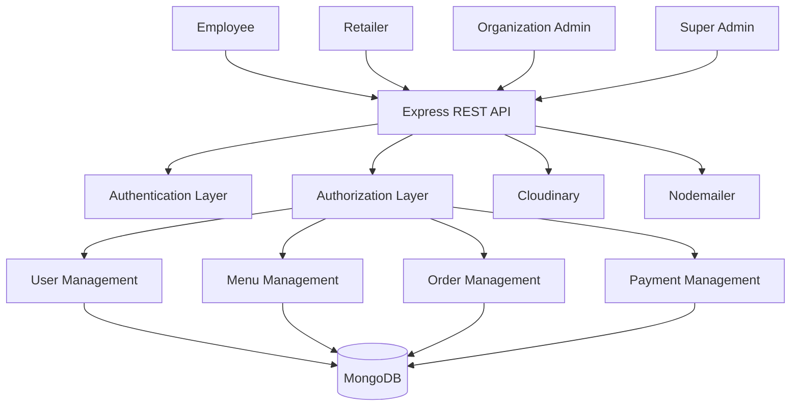

# 🍱 Tiffin Management System Backend

Backend platform for managing multi-tenant tiffin ordering operations across organizations, employees, retailers, and administrators.

The system provides secure REST APIs for user management, menu management, order processing, role-based access control, retailer approval workflows, and payment management.

Designed to support enterprise food delivery operations where multiple organizations manage approved retailers and employees can place and track daily meal orders.

---

# 🚀 Key Features

## 👥 User Management

- Employee Registration & Login
- Retailer Registration & Approval Workflow
- Organization Admin Management
- Super Admin Controls
- Profile Management
- Secure Authentication

---

## 🔐 Authentication & Authorization

- JWT Authentication
- Role-Based Access Control (RBAC)
- Protected APIs
- Access Permission Management
- Session Security

---

## 🏢 Multi-Tenant Architecture

- Multiple Organizations Support
- Organization-specific Admins
- Organization-specific Employees
- Retailer Approval per Organization
- Tenant Isolation

---

## 🍽️ Menu Management

- Create and Manage Tiffins
- Veg / Non-Veg Categories
- Pricing Management
- Availability Management
- Image Upload Support
- Menu Ratings & Reviews

---

## 📦 Order Management

- Place Orders
- Order Tracking
- Order Cancellation
- Delivery Scheduling
- Status Updates
- Order History

### Order Lifecycle

```text
Placed
   ↓
Accepted
   ↓
Preparing
   ↓
Out For Delivery
   ↓
Delivered
```

---

## 💳 Payment Management

- Cash On Delivery
- UPI Payments
- Payment Tracking
- Payment Status Management
- Transaction History

---

## 🛒 Cart Management

- Add Items
- Remove Items
- Quantity Updates
- Checkout Process

---

## 📊 Admin Dashboard

- User Monitoring
- Retailer Approval Management
- Order Analytics
- Payment Analytics
- Organization Management

---

# 🛠️ Tech Stack

| Layer | Technologies |
|---------|-------------|
| Backend | Node.js |
| Framework | Express.js |
| Language | JavaScript / TypeScript |
| Authentication | JWT |
| Authorization | RBAC |
| Database | MongoDB |
| Validation | Joi |
| Password Security | Bcrypt |
| File Uploads | Multer |
| Image Storage | Cloudinary |
| Email Service | Nodemailer |
| API Testing | Postman |
| Architecture | REST API |

---

# 🏗️ System Architecture



---

# 📊 Database Modules

## Users

- Employees
- Retailers
- Organization Admins
- Super Admins

---

## Organizations

- Organization Details
- Organization Admin Mapping

---

## Menu Items

- Name
- Description
- Type
- Price
- Availability
- Rating

---

## Orders

- User Information
- Ordered Items
- Delivery Details
- Payment Information
- Order Status

---

## Payments

- Transaction Details
- Payment Method
- Payment Status

---

# 🔌 REST API Modules

## Authentication APIs

```http
POST /auth/register
POST /auth/login
POST /auth/logout
```

---

## User APIs

```http
GET /users
GET /users/:id
PUT /users/:id
```

---

## Menu APIs

```http
GET /menu
POST /menu
PUT /menu/:id
DELETE /menu/:id
```

---

## Order APIs

```http
POST /orders
GET /orders
GET /orders/:id
PUT /orders/:id
```

---

## Payment APIs

```http
POST /payments
GET /payments
```

---

# ⚙️ Installation

## Clone Repository

```bash
git clone https://github.com/tanvi-2103-git/tiffin-node-backend.git
```

## Install Dependencies

```bash
npm install
```

## Configure Environment Variables

```env
PORT=3000

MONGO_URI=your_mongodb_connection

JWT_SECRET=your_secret

CLOUDINARY_NAME=your_cloudinary_name

CLOUDINARY_KEY=your_cloudinary_key

CLOUDINARY_SECRET=your_cloudinary_secret

EMAIL_USER=your_email

EMAIL_PASSWORD=your_password
```

---

# ▶️ Run Application

Development:

```bash
npm run dev
```

Production:

```bash
npm start
```

---

# 🎯 Business Use Cases

- Corporate Tiffin Management
- Employee Food Ordering
- Retailer Management
- Organization-specific Food Services
- Meal Subscription Platforms
- Multi-Tenant Food Delivery Systems

---

# 🔧 Technical Highlights

- JWT Authentication
- RBAC Authorization
- Multi-Tenant Architecture
- RESTful API Design
- Cloudinary Integration
- Secure Password Hashing
- Joi Request Validation
- Email Notification System
- Modular Backend Architecture
- Enterprise Workflow Management

---

# 👨‍💻 Author

**Tanvi Dudam**

🌐 Portfolio: https://tanvi-dudam-portfolio.vercel.app

💼 LinkedIn: https://www.linkedin.com/in/tanvi-dudam/

📧 Email: tanvidudam2003@gmail.com
